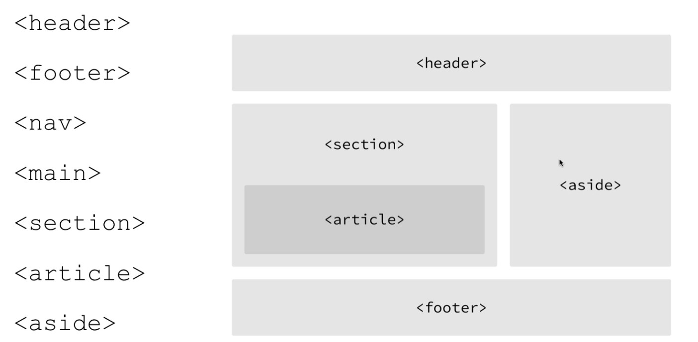
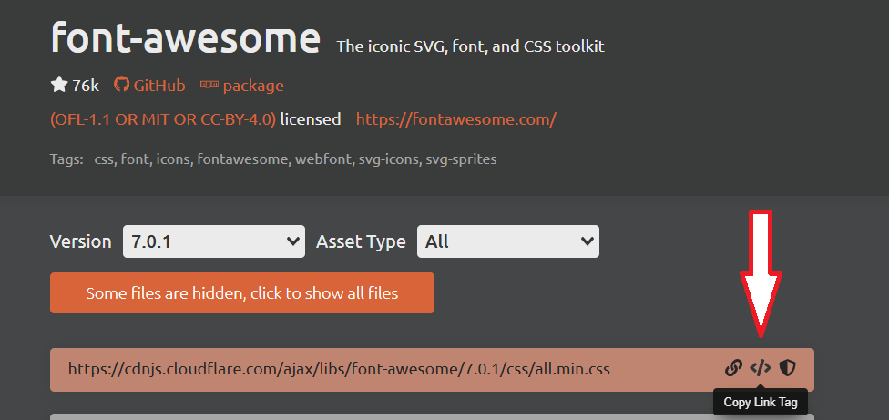

## Významové tagy



## Font Awesome

google: cdn font awesome

<https://cdnjs.com/libraries/font-awesome> -> click to copy

```html
<link rel="stylesheet" href="https://cdnjs.cloudflare.com/ajax/libs/font-awesome/7.0.1/css/all.min.css" ... />
```




<https://fontawesome.com/search?ip=classic&ic=free&o=r> -> click to copy

```html
<i class="fa-solid fa-camera"></i>
```

## Google Fonts

- googlete
- vyberte font ideálně pokud souhlasí `příliš žluťoučký kůň úpěl ďábelské ódy`
- nalinkujte do hlavičky 

## Menu (html)

```html
<nav id="navbar">
    <div class="logo">
        Moje <span class="text-primary">firma</span>
    </div>
    <ul>
        <li><a href="#home">Úvod</a></li>
        <li><a href="#about">O nás</a></li>
        <li><a href="#kontakt">Kontakt</a></li>
    </ul>
</nav>
```
---

## Menu (css)

```css
#navbar {
    background-color: #333;
    color: white;
    display: flex;
    justify-content: space-between;
    align-items: center;
    padding: 16px;
    font-size: 24px;
    font-weight: bold;
}

#navbar a {
    color: white;
    text-decoration: none;
}

#navbar ul {
    display: flex;
    list-style: none;
    align-items: center;
}

#navbar ul li a {
    padding: 10px;
    margin: 0 4px;
}

#navbar ul li a:hover {
    background-color: #93cb52;
    border-radius: 5px;
}

.text-primary {
    color: #93cb52;
}
```

## Úkol

Vytvořte nový repozitář na githubu a udělejte z něj webovou stránku. Vytvořte web na libovolné téma, který bude obsahovat všechny prvky z předchozích zadání. 
Do Teams sdílejte adresu nového webu.

::: {.callout-note}

- web může mít více stránek
- web obsahuje menu, které může odkazovat na sekce na stejné stránce, nebo na jiné stránky
- zkontrolujte validitu webu na <a href="https://validator.w3.org/" target="_blank">https://validator.w3.org/</a>

:::