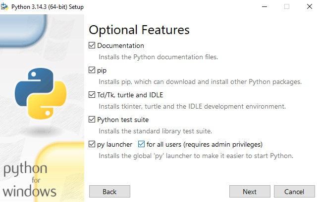

1. Do Googlu napíšeme "python"

2. Najdeme standalone installer a stáhneme

3. Spustíme instalátor, zaškrtneme PATH a vybereme Customize installation

4. Zvolíme instalaci pro všechny uživatele a je dobré vědět, kde ten python máme nainstalovaný.

4. Tady nic měnit nemusíme.

5. Ještě před ukončením instalace, klikneme na Disable path length limit.

6. Pracovní listy pracují s IDE IDLE (naleznete v nabídce Start).

7. Pro úvodní list doporučuji cmd.exe (powershell nebo terminál) kam napíšeme python a Enter. Následně pak přejdeme na Visual Studio Code.

Pokračujte prvním pracovním listem ze zadání v Teams.
