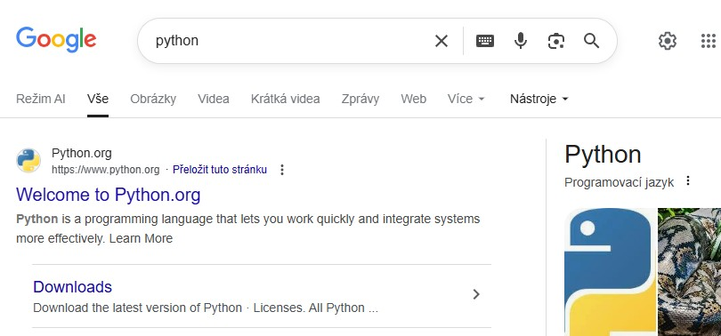
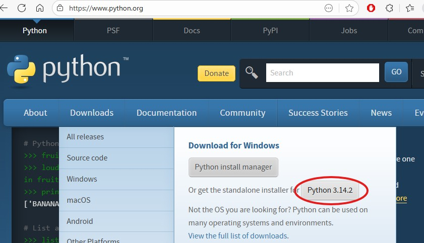
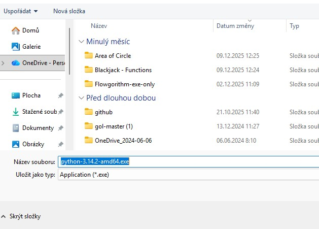
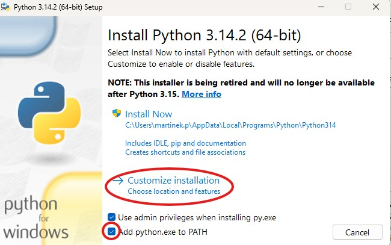
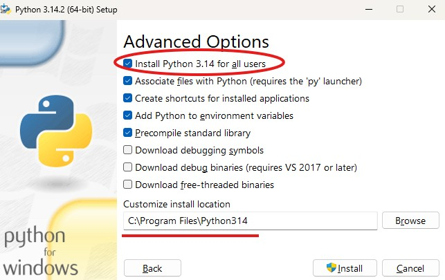
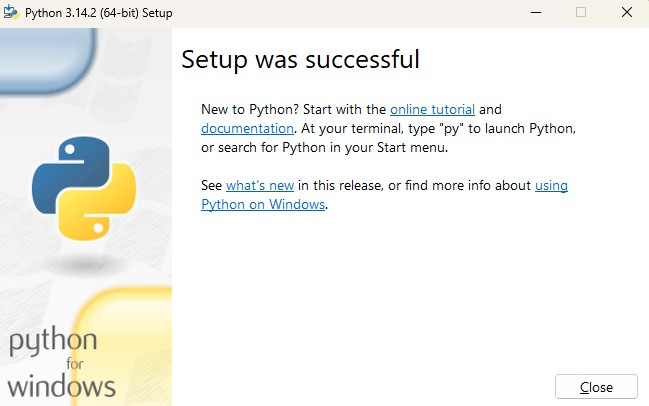
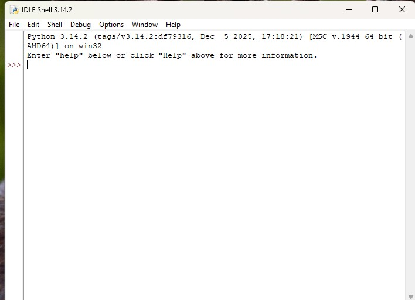
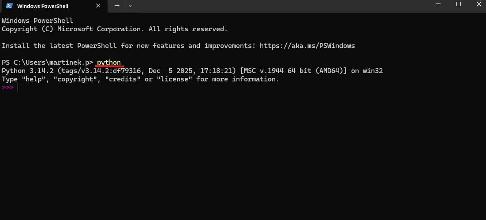

1. Do Googlu napíšeme "python"

2. Najdeme standalone installer a stáhneme

3. Spustíme instalátor, zaškrtneme PATH a vybereme Customize installation

4. Zvolíme instalaci pro všechny uživatele a je dobré vědět, kde ten python máme nainstalovaný.

5. Jednu obrazovku instalace jsem vynechal, nic se neměnilo. Je možné, že budete mít otázku ohledně PATH limitu, **VYBERTE** tuto možnost.

6. Pracovní listy pracují s IDE IDLE.

7. Pro úvodní list doporučuji cmd.exe (powershell nebo terminál) a pak přejdeme na Visual Studio Code.

Pokračujte prvním pracovním listem ze zadání v Teams.